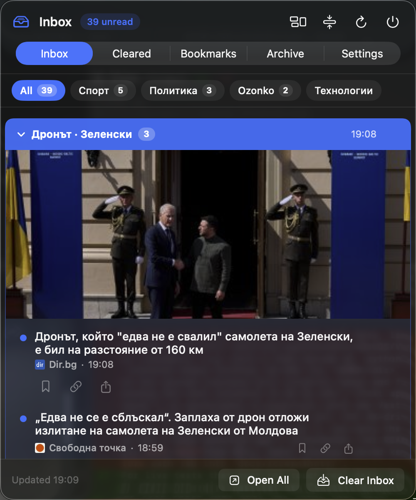
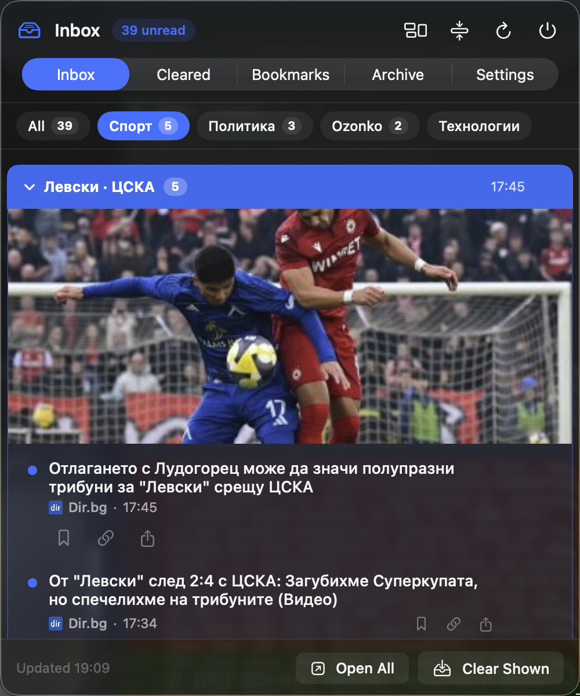
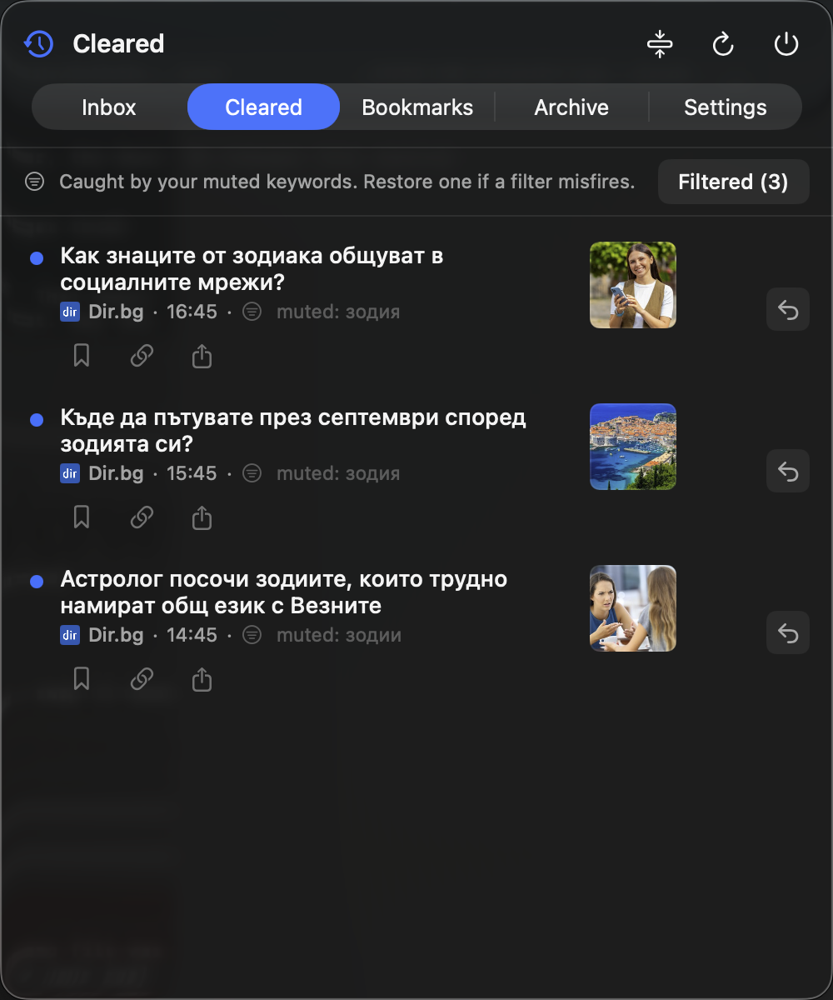
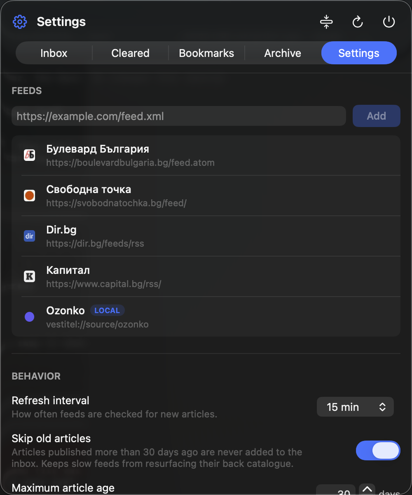
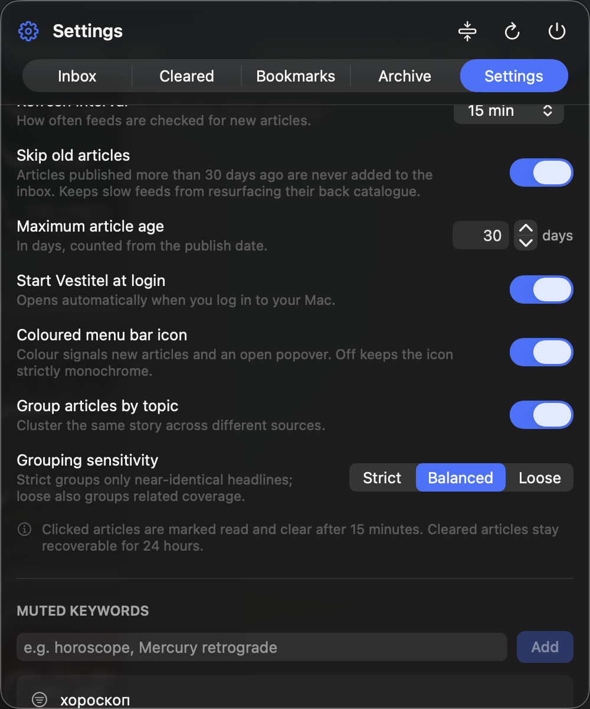
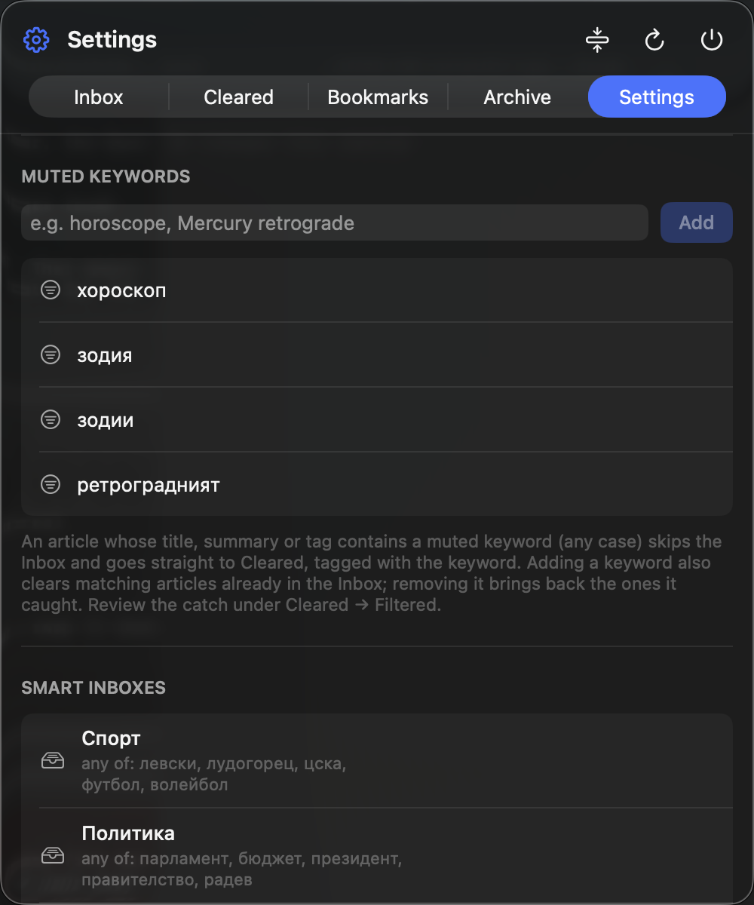
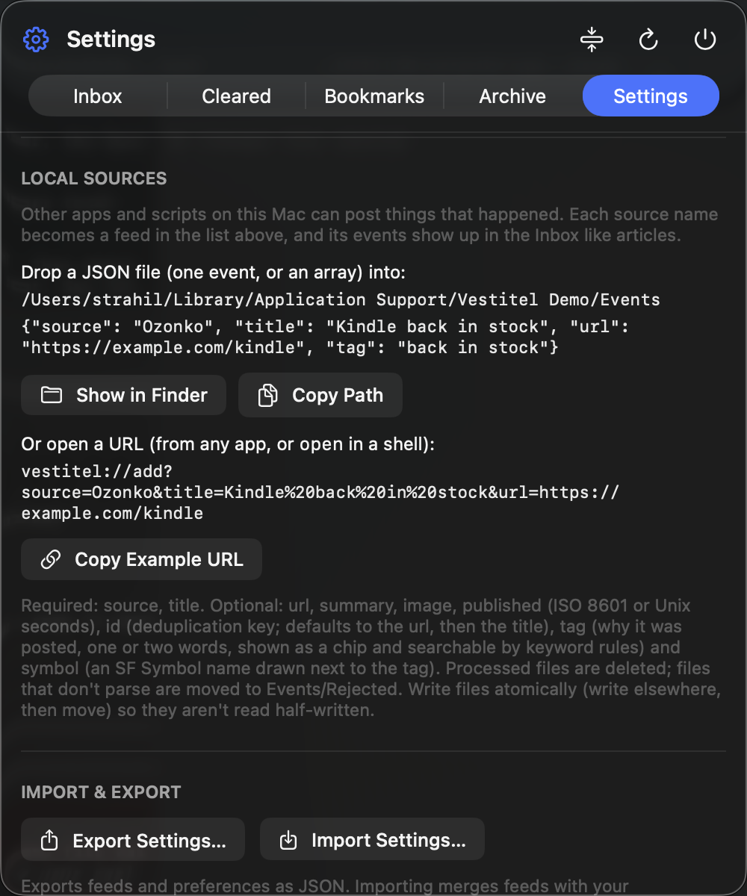
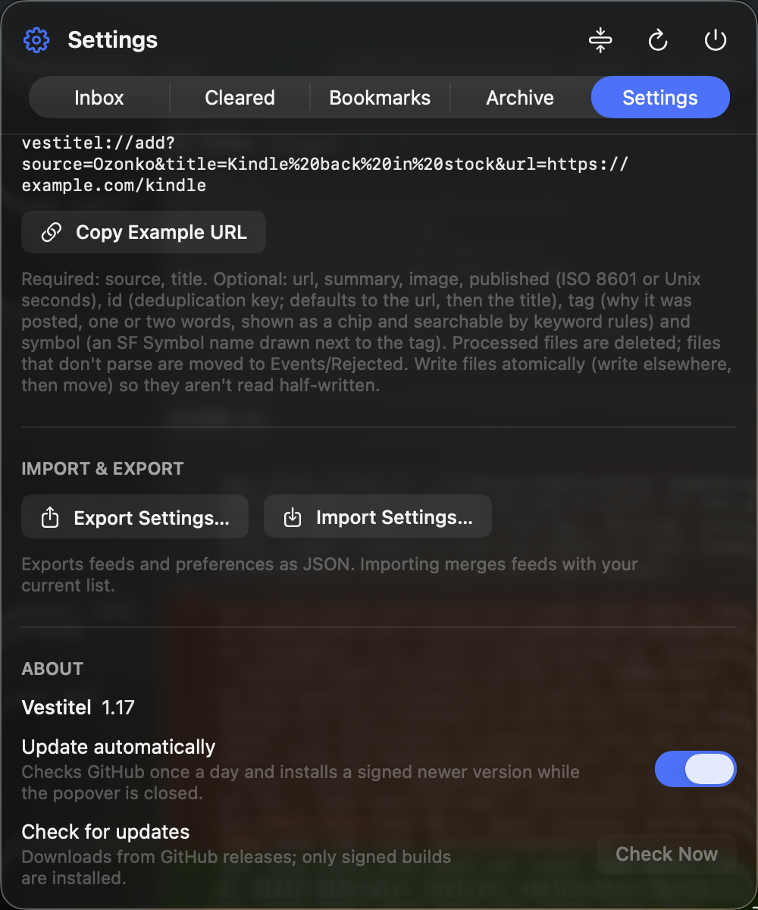

# Vestitel

A menu-bar inbox for things that happened. Vestitel lives entirely in a
popover under a menu bar icon (no Dock icon, no main window) and collects RSS
articles and events posted by other apps on your Mac into one inbox that you
read, clear, and forget.


| Inbox | A smart inbox |
|---|---|
|  |  |

| What the filters caught | Feeds and sources |
|---|---|
|  |  |

## How it works

Every article moves through the same short life: it arrives in the **Inbox**
(the menu bar icon lights up), you open it or clear it, cleared articles wait
in **Cleared** for 24 hours in case you want one back, then they're gone. Read
articles clear themselves 15 minutes after you open them. Anything you open is
remembered in **Archive**; anything you want to keep is a **Bookmark**.

## Features

- **RSS / Atom feeds**: paste any feed URL in Settings. Feeds refresh on launch
  and every 15 minutes (configurable). Per-feed colours and favicons.
- **Local sources**: other apps and scripts on the Mac post events into the
  Inbox through a drop folder or a `vestitel://add` URL, see below. Ozonko, a
  companion app that watches ozone.bg, posts its findings this way.
- **Topic grouping**: articles about the same story from different sources are
  clustered under one coloured header (keyword overlap with a Bulgarian
  stemmer, plus Apple NaturalLanguage sentence embeddings for English; digest
  rubrics such as "Бизнес глобус:" and price words are ignored). Click the
  header to collapse the group, swipe or × to clear it. Tune or turn off in
  Settings.
- **Group by source**: the Inbox header's grid button switches to one block
  per feed instead of topic groups.
- **Smart inboxes**: saved views of the Inbox, like Mail's smart mailboxes:
  keywords (any/all) and optional sources. They show as subtabs at the top of
  the Inbox with unread counts, in the order you choose; the ones that don't
  fit go into a More menu.
- **Filter**: the magnifier in the Inbox header (or ⌘F) opens a filter field in
  the header for a smart inbox you don't want to save: type words and the Inbox narrows
  to articles whose title, summary, tag or source name contains all of them,
  inside the selected smart inbox. Open All and Clear Shown act on what is
  shown; Esc dismisses it.
- **Muted keywords**: articles whose title, summary or tag contains a muted word
  skip the Inbox and go straight to Cleared, tagged with the keyword. The
  Cleared tab's "Filtered" toggle shows what they caught, with Restore if a
  filter misfires.
- **Sync between Macs**: point every Mac at the same cloud folder (Google
  Drive, iCloud Drive…). Feeds, read/cleared state, bookmarks and the
  never-show-again list merge with no conflicts: each Mac writes only its own
  file. Clearing on one Mac clears everywhere, and restoring an article
  from Cleared sticks: the latest action wins. Preferences stay per Mac unless you turn on preference sync, after
  which the newest change wins everywhere.
- **Desktop widget**: a big copy of the Inbox that lives on the desktop
  under your windows, in huge type, with new articles sliding in on top as
  they arrive, highlighted for five seconds so a glance shows what's new. No scrollbar, but it scrolls with the wheel or trackpad and pans when
  you press and drag the list. Move it by the grabber at the top, resize it
  by its edges, set the text size in points. Settings → Behavior.
- **Quiet while you read**: articles that arrive while the popover is open
  wait behind an "N new" button instead of shifting the list under you.
- **Swipe to clear**, hover × and Open in Browser on every row, right-click
  menus, copy link, Open All, Clear Inbox.
- **Skip old articles**: optionally ignore anything published more than N days
  ago, so a slow feed's back catalogue never floods the Inbox. **Compact
  rows** for a denser list.
- **Automatic updates**: once a day Vestitel checks GitHub releases and, while
  the popover is closed, installs a newer version whose release zip carries a
  valid ed25519 signature. Toggle or trigger it under Settings → About.
- **Import / Export settings** as JSON; **Start at login**.

| Behavior | Muted keywords and smart inboxes |
|---|---|
|  |  |

| Local sources | About and updates |
|---|---|
|  |  |

## Sending things to Vestitel from other apps

Any app or script on the Mac can post an event into the Inbox, either by
dropping a JSON file into `~/Library/Application Support/Vestitel/Events/`:

```json
{"source": "Ozonko", "title": "Kindle Paperwhite back in stock",
 "url": "https://www.ozone.bg/product/kindle", "id": "ozonko-4821"}
```

or by opening a URL:

```sh
open "vestitel://add?source=Backup%20Script&title=Nightly%20backup%20finished"
```

Each `source` becomes a feed of its own (marked LOCAL in Settings) that you can
colour, rename, and sync. The full guide, with the event format and shell and
Swift examples, is in [docs/local-sources.md](docs/local-sources.md). AI
assistants get the same contract from the `vestitel-events` Claude Code skill
in `.claude/skills/`.

## Install

Grab `Vestitel-X.Y.Z.zip` from the [latest release](https://github.com/haltsir/vestitel/releases/latest),
unzip, move `Vestitel.app` to /Applications. The app is ad-hoc signed (no Apple
Developer certificate), so on first launch macOS Gatekeeper refuses a normal
double-click: right-click → Open → Open, or

```sh
xattr -d com.apple.quarantine /Applications/Vestitel.app
```

After that first install, updates arrive on their own.

## Build & run

Requires macOS 14+ and the Swift toolchain (Xcode Command Line Tools suffice).

```sh
make app   # builds .build/release and packages Vestitel.app
make run   # builds and launches it
make icon  # regenerates Resources/AppIcon.icns from Tools/make-icon.swift
```

## Where data lives

- `~/Library/Application Support/Vestitel/state.json`: feeds, articles,
  archive, bookmarks, settings. Delete it to reset the app.
- `~/Library/Application Support/Vestitel/Events/`: the drop folder for
  local sources (`Rejected/` inside it holds files that didn't parse).
- `~/Library/Application Support/Vestitel/favicons/`: cached site icons.

## Layout

```
Sources/Vestitel/
  VestitelApp.swift        MenuBarExtra entry point, URL-scheme delegate
  Models.swift             Feed / Article / SmartInbox / settings types
  AppStore.swift           state machine, fetching, timers, persistence, filters
  FeedParser.swift         dependency-free RSS 2.0 / RSS 1.0 / Atom parser
  LocalSources.swift       events drop folder + vestitel://add URL scheme
  SyncEngine.swift         multi-Mac sync through a shared folder
  Updater.swift            signed self-update from GitHub releases
  TopicGrouper.swift       cross-source topic clustering
  NotificationManager.swift, MenuBarIcon.swift, SourcePalette.swift, FaviconStore.swift
  Views/                   popover UI (Inbox, Cleared, Bookmarks, Archive, Settings)
Tools/sign-release.swift   signs a release zip with the ed25519 release key
Tools/make-icon.swift      draws the app icon
docs/                      user documentation and screenshots
```

## Behavior details

- Feeds refresh on launch and then every N minutes (configurable, default 15).
- A 30-second sweep timer promotes read → cleared (after 15 min), purges
  cleared articles older than 24 h, and runs the daily update check.
- Purged articles won't reappear on the next fetch: ingested article ids are
  remembered for 30 days after the last fetch that still listed them (and
  shared between synced Macs).
- Optionally (Settings → Behavior → Skip old articles), items published more
  than N days ago are never added to the inbox, so a slow feed's back
  catalogue stays out of the way.
- Removing a feed drops its unread inbox articles but keeps read/cleared
  history and the archive. A removed local source comes back when its
  producer posts again.
